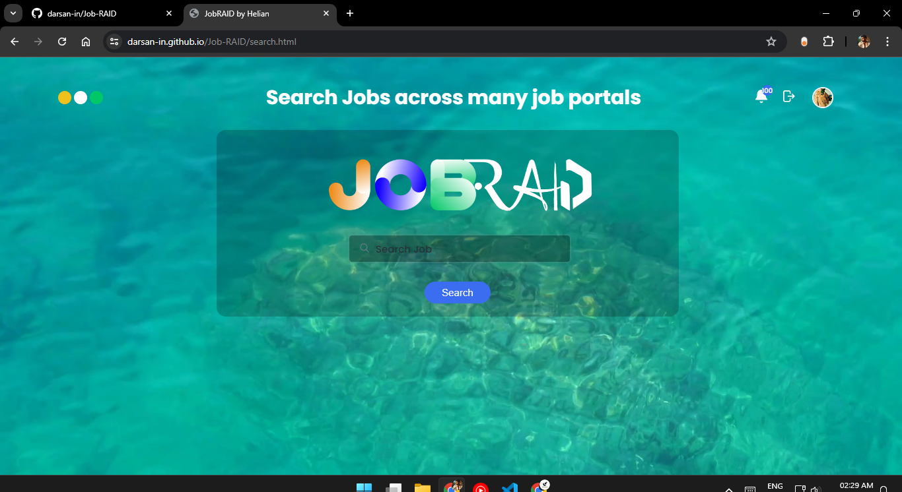

<div align="center">

# Job RAID - One-Stop Job Search Engine

<p id="intro">Job RAID is a search engine that aggregates results from multiple job listing websites, allowing you to search and filter jobs across various portals in one place. It saves you time by eliminating the need to visit each site separately and helps you find jobs that match your desired salary or skill set more efficiently.</p>

---

<p>

<span>
  <a href="https://github.com/darsan-in/Job-RAID/commits/main">
    
  </a>
</span>

<span>
  <a href="">
    
  </a>
</span>

</p>

<p>

<span>
  <a href="https://github.com/darsan-in/Job-RAID/actions/workflows/pages/pages-build-deployment">
    
  </a>
</span>

</p>

---

<p>

<span>
  <a href="LICENSE">
    
  </a>
</span>

<span>
  <a href="https://github.com/darsan-in/Job-RAID/releases">
    
  </a>
</span>

</p>

<p>

<span>
  <a href="https://www.codefactor.io/repository/github/darsan-in/Job-RAID/issues/main">
    
  </a>
</span>

</p>

---

<p>

<span>
  <a href="">
    
  </a>
</span>

<span>
  <a href="https://github.com/sponsors/darsan-in">
    
  </a>
</span>

</p>

---

</div>

## Table of Contents 📝

- [Features and Benefits](#features-and-benefits-)
- [Use Cases](#use-cases-)
- [Friendly request to users](#-friendly-request-to-users)

- [Installation - Step-by-Step Guide](#installation---step-by-step-guide-)
- [In-Action](#in-action-)

- [License](#license-%EF%B8%8F)
- [Contributing to Our Project](#contributing-to-our-project-)
- [Website](#website-)

- [Contact Information](#contact-information)
- [Credits](#credits-)

## Features and Benefits ✨

- Aggregate job listings from multiple websites
- Unified search across all job portals
- Advanced filtering options by salary, skills, and more
- Saves time by avoiding repetitive searches on different sites
- Find the most relevant jobs based on your preferences
- Easy-to-use interface for quick job discovery

## Use Cases ✅

- Searching for jobs that match your preferred salary range across multiple websites
- Filtering job listings by specific skills or qualifications
- Efficiently finding the best job opportunities without visiting multiple portals
- Comparing salaries for similar roles across different job sites
- Discovering hidden job opportunities that may not appear on your go-to job portal
- Streamlining the job search process by using a single platform

---

### 🙏🏻 Friendly Request to Users

Every star on this repository is a sign of encouragement, a vote of confidence, and a reminder that our work is making a difference. If this project has brought value to you, even in the smallest way, **please consider showing your support by giving it a star.** ⭐

_"Star" button located at the top-right of the page, near the repository name._

Your star isn’t just a digital icon—it’s a beacon that tells us we're on the right path, that our efforts are appreciated, and that this work matters. It fuels our passion and drives us to keep improving, building, and sharing.

If you believe in what we’re doing, **please share this project with others who might find it helpful.** Together, we can create something truly meaningful.

Thank you for being part of this journey. Your support means the world to us. 🌍💖

---

## Installation - Step-by-Step Guide 🪜

⚠️ Below instructions are only applicable to windows user

- **Step 1:** Install Ampps in system, if not already installed.
- **Step 2:** Open ampps server root directory basically, it is `www` folder inside ampss folder.
- **Step 3:** Clone this repository inside `www`.

```bash
git clone https://github.com/darsan-in/Job-RAID.git
```

- **Step 4:** Start the ampps server.
- **Step 5:** Now you can view this app in your browser through http://localhost:80/Job-RAID

## In-Action 🤺



## License ©️

This project is licensed under the [Apache License 2.0](LICENSE).

## Contributing to Our Project 🤝

We’re always open to contributions and fixing issues—your help makes this project better for everyone.

If you encounter any errors or issues, please don’t hesitate to [raise an issue](../../issues/new). This ensures we can address problems quickly and improve the project.

For those who want to contribute, we kindly ask you to review our [Contribution Guidelines](CONTRIBUTING) before getting started. This helps ensure that all contributions align with the project's direction and comply with our existing [license](LICENSE).

We deeply appreciate everyone who contributes or raises issues—your efforts are crucial to building a stronger community. Together, we can create something truly impactful.

Thank you for being part of this journey!

## Website 🌐

<a id="url" href="https://darsan-in.github.io/Job-RAID/">https://darsan-in.github.io/Job-RAID/</a>

## Contact Information

For any questions, please reach out via hello@darsan.in or [LinkedIn](https://www.linkedin.com/in/darsan-in/).

## Credits 🙏🏻

Thanks to [Vicky](https://github.com/itzvixky) for making one of the job crawlers.

---

<p align="center">

<span>
<a href="https://www.linkedin.com/in/darsan-in/"></a>
</span>

<span>
  
</span>

<span>
<a href="https://www.youtube.com/@darsan-in"></a>
</span>

<span>
  
</span>

<span>
<a href="https://www.facebook.com/darsan.in/"></a>
</span>

<span>
  
</span>

<span>
<a href="https://www.npmjs.com/~darsan.in"></a>
</span>

<span>
  
</span>

<span>
<a href="https://github.com/darsan-in"></a>
</span>

<span>
  
</span>

<span>
<a href="https://huggingface.co/darsan"></a>
</span>

<span>
  
</span>

<span>
<a href="https://www.reddit.com/user/iamspdarsan/"></a>
</span>

<span>
  
</span>

<span>
<a href="https://darsan.in/"></a>
</span>

<p>

---

#### Topics

<ul id="keywords">
<li>job search</li>
<li>job aggregation</li>
<li>job portal</li>
<li>job filter</li>
<li>salary comparison</li>
<li>job discovery</li>
<li>multi-platform job search</li>
<li>time-saving job search</li>
<li>online jobs</li>
<li>job listings</li>
<li>job engine</li>
<li>career search</li>
<li>job websites</li>
<li>job finder</li>
<li>job opportunities</li>
<li>efficient job search</li>
<li>job search platform</li>
<li>job search engine</li>
<li>aggregate job listings</li>
</ul>
